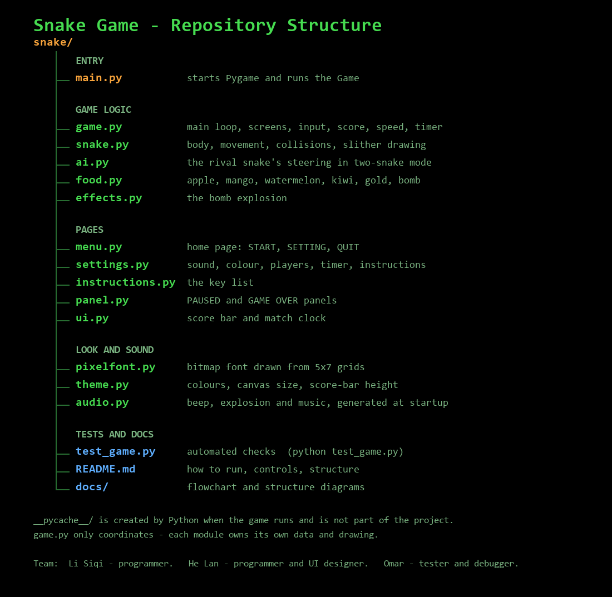

# Snake Game

A Snake game built with Python and Pygame.

- **Team**: 何岚, 李思齐， 奥马尔
- **Instructor**: 黄天羽
- **Built with**: Python 3, Pygame 2.x

## Running it

```bash
pip install pygame
python main.py
```

The window can be resized, minimised and maximised. The play field grows
with it; the score bar keeps its height.

## Controls

| Key | Action |
|-----|--------|
| ↑ ↓ ← → | Steer the snake (and move around menus) |
| Enter / Space | Choose the selected item |
| P | Pause |
| R | Restart |
| S | Open the setting page (from the home page) |
| Esc | Back to the home page (from a menu, or after game over) |
| Q | Quit (from any menu or panel) |

During play only the arrows, P and R do anything; leaving the game goes
through the pause or game-over panel. Menus and buttons also respond to
the mouse.

## Pages

- **Home** — SNAKE GAME, START, SETTING, QUIT.
- **Setting** — sound ON/OFF, snake colour (green, orange, blue),
  players mode (1 or 2), timer (OFF, 60 or 90), and a link to the
  instruction page.
- **Instructions** — the key list above.
- **Game** — score bar on top, play field below it.
- **Paused** and **Game Over** — a panel showing the score, with
  RESUME/REPLAY and QUIT.

Everything is drawn in a green-on-black terminal style using a bitmap
font defined in code (`pixelfont.py`), so the game ships with no image
or audio files at all.

## Playing

The snake slithers: a wave travels down its body as it moves, it glides
between cells rather than jumping, and it grows thicker as it gets
longer. It dies on the walls or on itself.

It starts slow and speeds up with every point, from 170 ms per step down
to 80 ms, after which it stays at that pace.

| Food | Effect |
|------|--------|
| Apple, mango, watermelon, kiwi | +1 point, grows 1 segment |
| Gold | +3 points, grows 3 segments |
| Bomb | Eating it explodes and ends the game |

Food does not wait forever. Anything left uneaten blinks and then
vanishes — fruit after 9 seconds, gold after 6, a bomb after 4. Two
seconds before a fruit or a gold goes, its replacement already appears
somewhere else (fruit, gold or bomb, at random), so for that moment
there are two things on the field and you are never left with nothing
to chase.

A bomb explodes when it goes, but the blast is only for show: it costs
neither snake any points or segments. A bomb is dangerous only if you
eat it.

**Players mode.** 1 is the normal one-snake game. Set it to 2 and a
second snake shares the field, hunting the food for itself and refusing
to enter a bomb's cell. It keeps its own score, shown as RIVAL on the
score bar and on the pause and game-over panels, so you are racing it.
The two snakes pass through each other — neither can eat the other, and
even a head-on meeting is harmless. The rival takes a fresh colour every
game, picked at random from the two you are not using. If it hits a wall
or itself it simply starts again; only your own snake can end the game.

Both snakes start somewhere different every game, never on top of each
other.

**Timer.** OFF plays with no clock. Pick 60 or 90 and that many seconds
appear at the right of the score bar, counting down. When it reaches
zero the game ends and the game-over panel shows the final score — both
scores in two-snake mode, headed by YOU WON or YOU LOST. A draw says
nothing.

Sound effects and the background music are generated as waveforms at
startup (`audio.py`). The music only plays during active play, and the
SOUND setting mutes everything.

## Structure



The screen flow is in [docs/flowchart.md](docs/flowchart.md).

| File | Responsibility |
|------|----------------|
| `main.py` | Entry point: starts Pygame and runs `Game` |
| `game.py` | Main loop, state machine, input, scoring, resizing |
| `snake.py` | Body, movement, collisions, and the slither drawing |
| `ai.py` | The rival snake's steering in two-snake mode |
| `food.py` | Food types, spawning, and their artwork |
| `effects.py` | The bomb explosion |
| `menu.py`, `settings.py`, `instructions.py`, `panel.py` | The pages |
| `ui.py` | The score bar and the clock |
| `pixelfont.py`, `theme.py` | Bitmap font and shared colours |
| `audio.py` | Generated beep, explosion and music |
| `test_game.py` | Automated checks |
| `docs/` | Flowchart and structure diagrams |

`Game` only coordinates: it never touches the snake's coordinates
directly. Each module owns its own data and drawing.

## Notable details

**No instant reversal.** A direction key sets `next_direction`, which
`move()` commits later, and it is checked against the *committed*
direction. So pressing ↑ then ← in one frame while moving right cannot
turn the snake back into itself.

**Food never hidden.** Spawning resamples until the cell is free of the
snake, and never picks a row behind the score bar.

**Restart rebuilds objects** rather than resetting fields one by one, so
no stale state can survive.

**Fixed-step movement.** The snake steps on a timer while the loop runs
at 60 FPS, and frames in between are drawn part way through the step —
speed is set by that timer, not by how fast the game renders.

## Tests

```bash
python test_game.py
```

Fourteen checks covering reversal blocking, food placement (including
staying below the score bar), restart, collisions, per-food score and
growth, the fatal bomb, the harmless burnout, early food handover,
rising speed, the match timer, two-snake mode with its random starts
and colours, and a 2000-step fuzz run. All passing.
