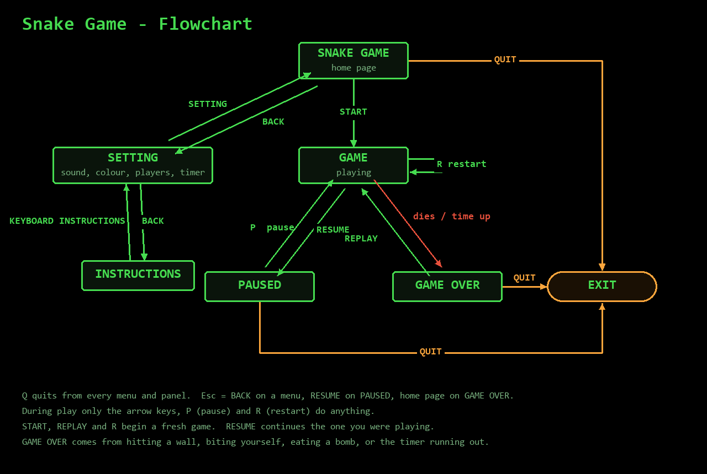
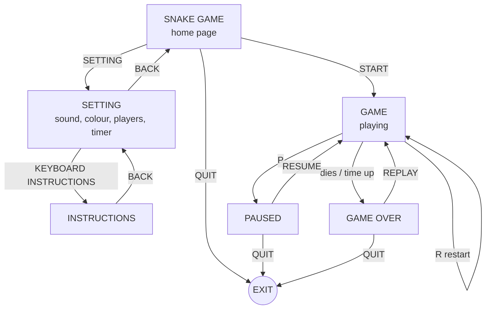

# Snake Game — Flowchart



Q quits from every menu and panel. Esc means BACK on a menu, RESUME on
PAUSED, and the home page on GAME OVER. During play only the arrow keys,
P (pause) and R (restart) do anything.

GAME OVER comes from hitting a wall, biting yourself, eating a bomb, or
the timer running out. Its panel shows the final score — both scores in
two-snake mode, headed by YOU WON or YOU LOST.

The same chart as text, for editing (renders on GitHub and in VS Code):



Both pictures are drawn by `draw_flowchart.py` and `draw_structure.py`
in this folder:

```bash
python docs/draw_flowchart.py
python docs/draw_structure.py
```
