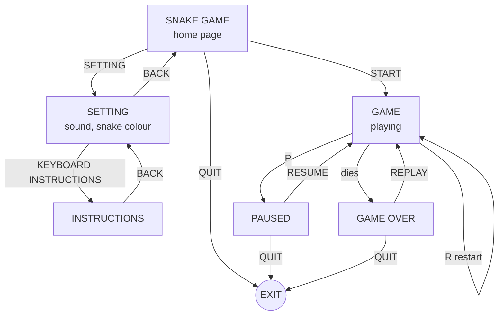

# Snake Game — Flowchart

Q quits from every menu and panel. Esc means BACK on a menu, RESUME on
PAUSED, and the home page on GAME OVER. During play only the arrow keys,
P (pause) and R (restart) do anything.

The same chart as text, for editing (renders on GitHub and in VS Code):

